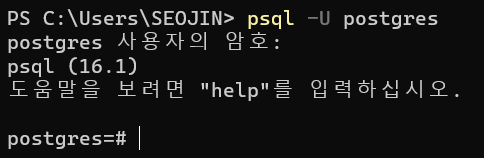
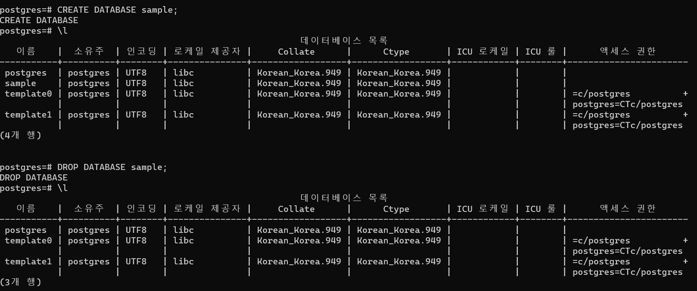
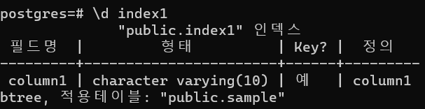
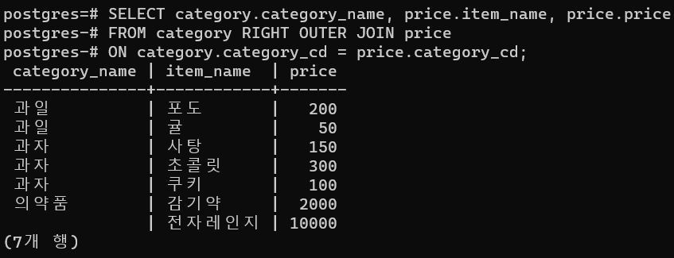

## 스택 영역과 힙 영역

- 클래스 등 참조형 데이터는 인스턴스화될 때까지 메모리 영역을 어느정도 사용할지 알 수 없으므로, 참조 주소를 저장할 수 있는 크기만 확보, 인스턴스화되었을 때 값은 메모리 영역의 힙 영역에 저장한다.
- 스택 영역에는 참조형 데이터 값은 어느 힙 영역을 보면 되는지 알 수 있도록 인스턴스 주소가 저장된다.

## 래퍼 클래스(wrapper class)

- 참조형 값만 받는다고 정의되어 있으면, 기본 자료형을 이용할 수 없는 경우도 있다.
- 이때는 기본 자료형을 클래스로 변환
- Byte, Short, Integer, Long, Float, Double, Character, Boolean
- 래퍼클래스의 초깃값은 0이 아닌 null-> 자동으로 변환되면 예외가 발생한다.

```java
Integer num = new Integer(17); // 박싱

int n = num.intValue();        // 언박싱

System.out.println(n);


Character ch = 'X'; // Character ch = new Character('X'); : 오토박싱

char c = ch;        // char c = ch.charValue();           : 오토언박싱
```

### 기본 자료형에서 주의해야 할 점

- 자료형의 범위를 넘더라도 오류가 발생하지 않는다.

#### 명령줄 인수 넣는 방법 알아두기

## 객체지향

- 실세계의 사물을 프로그램으로 표현하기 위한 사고방식

1. 캡슐화: 객체의 속성이나 행위를 호출하는 것을 제한
2. 상속: 이미 존재하는 클래스의 속성이나 행위를 물려받아 새롭게 정의하는 클래스의 일부로 만드는 구조
3. 다형성: 여러 객체의 공통된 속성과 행위를 추출해, 하나의 객체를 만드는 것

- 공통된 속성과 행위를 가진 객체를 하나로 모아 사용(IS-A관계)

### 오버라이딩

- 상속에서는 그 밖에도 자식 클래스에서 부모 클래스의 메서드 정의를 덮어써 다르게 동작하도록 재정의 할 수 있다.

### 추상 클래스

- 추상 메서드를 포함하는 클래스를 말한다.
- 이름, 반환형, 인수만 정의한 메서드.

### 인터페이스

- 추상메서드만 있는 클래스를 말한다.
- 인터페이스를 구현한 클래스에서 실제 처리를 한다.

### 위임

- 2개 이상의 클래스를 상속(다중 상속)할 필요가 있는 자식 클래스를 만들 경우

```java
// Employ 클래스 내 echo() 메서드가 존재.

// Manager 클래스에서
// Employee 클래스 인스턴스를 생성하고
// 사원 클래스의 응답 메서드를 사용한다.
```

### 상속과 위임의 단점

- 상속 계층이 깊으면 처리를 추적하기 어렵다.
- 부모 클래스를 수정하면 자식 클래스에 영향을 미친다.

## 제네릭

- 클래스 내부에서 사용할 자료형을 정의해 타입 세이프(타입 안정성)를 구현하는 기능
- 자바 5부터 도입

## 람다식

- 메서드를 간단히 기술하는 기법

## 날짜 및 시간 클래스

- java.util.Date: 특정 날짜 지증
- java.util.Calender: 일시에 대한 다양한 조작
- java.text.SimpleDataFormat: 지정한 서식에 따라 문자열을 Date 클래스로 변환하거나, 그 반대로 처리한다.

## java.time 패키지

- 시차를 다루지 않으면 Local 로 시작되는 클래스를 사용한다.
- 시차를 다루면 Offset으로 시작되는 클래스를 사용한다.
- 시차뿐 아니라 그 지역의 일시가 고려된 편이 바람직하면 `ZonedDateTime`을 사용한다.

## PostgreSQL

> "C:\Program Files\PostgreSQL\16\bin\psql.exe" -U postgres

- 암호 입력
- SELECT version(); -> 1개 행 결과 출력
- 환경 변수 설정 후에 명령어 간결해짐
- 
  - > psql -U postgres

#### 접속

- psql -U 사용자명 (-d 데이터베이스명)
  (-d 데이터베이스명, -h 호스트명, -L 파일명, -f 파일명)

- 접속 해제 : `\q`
- CREATE DATABASE sample;
- 데이터베이스 목록 보기: `\l`

  > sample 데이터 베이스에 접속하려면
  >
  > - psql -U postgres sample
  > - 이미 연결된 상태라면 : \c sample 입력해 사용할 데이터베이스를 선택

- 데이터베이스 삭제: - DROP DATABASE sample;
  

- 테이블 생성
  > CREATE TABLE sample(column1 varchar(10) PRIMARY KEY, column2 integer CHECK(Column2 > 0));
- 테이블 목록 표시 : `\d`
- 테이블 정의 표시 : \d sample
- 테이블 변경 구문 : `ALTER TABLE 테이블명 [ADD|DROP|ALTER|RENAME] 변경문;`

```SQL
postgres=# ALTER TABLE sample ADD COLUMN column3 varchar(10);
ALTER TABLE
postgres=# ALTER TABLE sample DROP COLUMN column3;
ALTER TABLE
postgres=# ALTER TABLE sample ALTER COLUMN column1 TYPE varchar(10);
ALTER TABLE
postgres=# DROP TABLE sample;
DROP TABLE
```

- 인덱스 생성: `CREATE INDEX index1 ON sample (column1);`
- 인덱스 확인: \di
- 인덱스 정의 표시 : \d index1
  
- 인덱스 삭제: DROP INDEX 인덱스명;
- 롤 생성: `CREATE ROLE sample_user WITH LOGIN PASSWORD 'pass';`

```sql
postgres=# CREATE ROLE sample_user WITH LOGIN PASSWORD 'pass';
CREATE ROLE
postgres=# SELECT usename FROM pg_user;
   usename
-------------
 postgres
 sample_user
(2개 행)
```

- 권한의 종류
  > CONNECT(접속), SELECT(조회), INSERT(추가), DELETE(삭제), ALL PRIVILIEGES(모든 기능)

```sql
postgres=# CREATE TABLE sample(column1 varchar(10) PRIMARY KEY, column2 integer CHECK(Column2 > 0));
CREATE TABLE
postgres=# SELECT column1 from sample;
 column1
---------
(0개 행)


postgres=# INSERT INTO sample VALUES('안녕', 10);
INSERT 0 1
postgres=# SELECT * FROM sample;
 column1 | column2
---------+---------
 안녕    |      10
(1개 행)
```

- 내부 결합: 공통된 컬럼값을 사용해 결합

```sql
CREATE TABLE price(
	category_cd integer,
	item_name varchar(30),
	price integer
);

INSERT INTO price VALUES(01, '귤', 50);
INSERT INTO price VALUES(01, '포도', 200);
INSERT INTO price VALUES(02, '쿠키', 100);
INSERT INTO price VALUES(02, '초콜릿', 300);
INSERT INTO price VALUES(02, '사탕', 150);
INSERT INTO price VALUES(03, '감기약', 2000);

CREATE TABLE category(
	category_id integer,
	category_name varchar(30)
);
INSERT INTO category VALUES(01, '과일');
INSERT INTO category VALUES(02, '과자');
INSERT INTO category VALUES(03, '의약품');

SELECT category.category_name, price.item_name, price.price
FROM category INNER JOIN price
ON category.category_cd = price.category_cd;

postgres-# ON category.category_cd = price.category_cd;
 category_name | item_name | price
---------------+-----------+-------
 과일          | 포도      |   200
 과일          | 귤        |    50
 과자          | 사탕      |   150
 과자          | 초콜릿    |   300
 과자          | 쿠키      |   100
 의약품        | 감기약    |  2000
(6개 행)
```

- WHERE절 조인
  > SELECT category.category_name, price.item_name, price.price
  > FROM category, price
  > WHERE category.category_cd = price.category_cd;
- LEFT OUTER JOIN : 왼쪽 테이블의 레코드가 모두 추출되는

```SQL
postgres=# INSERT INTO category VALUES(04, '잡화');
INSERT 0 1
postgres=# INSERT INTO price VALUES(05, '전자레인지', 10000);
INSERT 0 1
postgres=# SELECT category.category_name, price.item_name, price.price
postgres-# FROM category LEFT OUTER JOIN price
postgres-# ON category.category_cd = price.category_cd;
 category_name | item_name | price
---------------+-----------+-------
 과일          | 포도      |   200
 과일          | 귤        |    50
 과자          | 사탕      |   150
 과자          | 초콜릿    |   300
 과자          | 쿠키      |   100
 의약품        | 감기약    |  2000
 잡화          |           |
(7개 행)
```

- RIGHT OUTER JOIN
  
- 데이터베이스 애플리케이션의 기본: 접속-> 처리 -> 접속 해제

---

## 예제 프로그램을 처리 단계별로 설명

- java.sql 패키지의 주요 클래스

  - Connection: 데이터베이스에 접속하기 위한 클래스
  - DriverManagaer: JDBC 드라이버를 다루는 기능이 구현된 클래스
  - Statement: 정적 SQL을 실행해 결과를 가져오는 클래스
  - PreparedStatement : 동적 SQL을 실행해 결과를 가져오는 클래스
  - ResultSet : SQL 처리 결과를 저장하는 클래스

- JDBC 드라이버 로딩
  - Class.forName(JDBC 드라이버의*전체*주소\_이름);
  - try catch 구문 필요
- 데이터베이스에 접속
  - conn = DriverManager.getConnection("jdbc:postgresql:postgres", "postgres", "**\*\***");
  - "jdbc:postgresql:데이터베이스명", "사용자명", "암호"
  - RDBMS와 데이터베이스 접속 조건에 따라 다르다.
- SELECT 문 발행과 결과 획득

```java
// Statement 오브젝트 생성
Statement stmt = conn.createStatement(); --- SQL을 저장할 객체

// SELECT 문을 발행하고 검색 결과를 저장한다.
ResultSet rset = stmt.executeQuery("SELECT * FROM book");
```

- executeQuery: select 명령을 실행, 데이터베이스에서 가져온 레코드를 반환
  - 결과는 ResultSet 클래스의 객체로 받는다.

```java
// 3. 결과 표시
while(rset.next()){
    System.out.println(rset.getString("name"));
}
```

- next메서드로 다음 레코드를 가져온다. 현재 레코드에서 지정한 컬럼의 값을 추출한다.
- next 메서드는 while 루프의 종료 조건으로 지정하면, 모든 레코드를 가져온 후 처리를 종료한다.
- 데이터베이스 접속 해제

```java
} catch (SQLException e) {
            // 접속, SELECT 문 발행에서 오류가 발생한 경우
            e.printStackTrace();
            //throw new RuntimeException(e);
        }finally{
            // 4. 데이터베이스 접속 해제
            if(conn != null){
                try{
                    conn.close();
                    conn = null;
                } catch (SQLException e) {
                    // 데이터베이스 접속 해제에서 오류가 발생한 경우
                    e.printStackTrace();
                }
            }
        }
```

- 해제처리는 finally 블록에서, Connection 클래스의 close 메서드로 접속을 끊어준다.

```java
package org.example;

import java.sql.*;

public class SelectSample2 { // try -with-resource 구문으로 변경하기
    public static void main(String[] args) { // try 블록 직후에 자동으로 폐기하고 싶은 리소스(접속)의 선언문을 기술하기만 하면 된다!
        // try 블록을 빠져나온 시점에 접속이 자동으로 해제된다.
        // JDBC 드라이버 로딩
        try{
            // postgreSQL의 JDBC 드라이버 로딩
            Class.forName("org.postgresql.Driver");
        } catch (ClassNotFoundException e) {
            // JDBC 드라이버를 찾지 못한 경우
            e.printStackTrace();
        }

        // 1. 데이터베이스 접속
        try (Connection conn = DriverManager.getConnection("jdbc:postgresql:postgres", "postgres", "******");){
            // 2. SELECT문 발행과 결과 획득
            // Statement 오브젝트 생성
            Statement stmt = conn.createStatement();

            // SELECT 문을 발행하고 검색 결과를 저장한다.
            ResultSet rset = stmt.executeQuery("SELECT * FROM book");

            // 3. 결과 표시
            while(rset.next()){
                System.out.println(rset.getString("name"));
            }
        } catch (SQLException e) {
            // 접속, SELECT 문 발행에서 오류가 발생한 경우
            e.printStackTrace();
        }
    }
}

```
