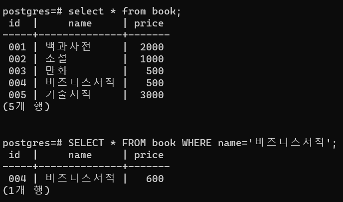
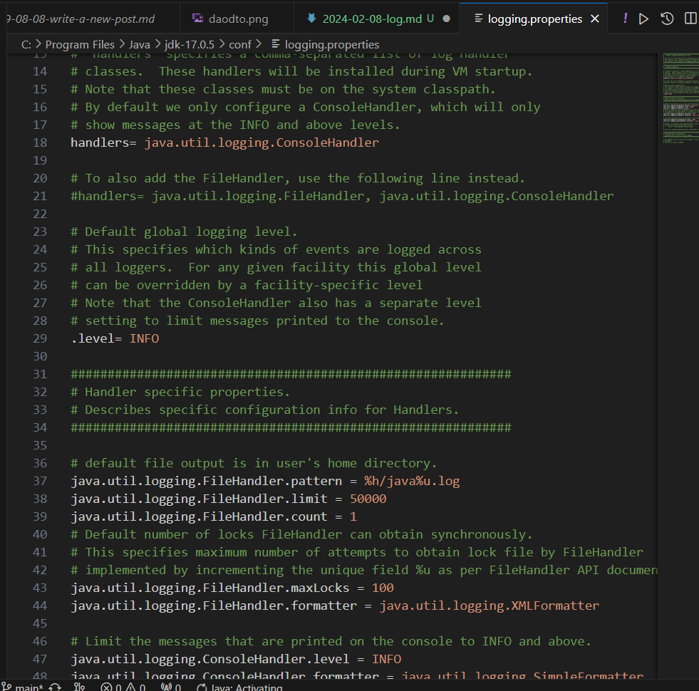

### 트랜잭션

- 서로 연동된 SQL 처리는 한 덩어리로 실행
- 커밋: 데이터 내용을 반영
- 롤백: 취소하고 원래대로 되돌리는 처리
- 트랜잭션 안에서 변경된 데이터는 커밋이나 롤백될 때까지 데이터베이스에 반영되지 않고,
  가상적인 데이터베이스 안에서 자신만이 변경을 확인할 수 있는 상태로 존재한다.
- DB에는 트랜잭션 마지막에 커밋을 시행한 시점에서 반영한다.

### 락

- RDBMS에서는 동시에 여러 트랜잭션 처리를 실행할 수 있다.
- 같은 레코드를 갱신할 경우, 한 트랜잭션에서 변경 중인 데이터를 다른 트랜잭션에 덮어쓰는 일이 생길 수 있다.
  > 락: 어떤 트랜잭션에서 갱신 중인 데이터를 다른 트랜잭션에서 갱신할 수 없게 잠그는 기능
- 트랜잭션이 커밋이나 롤백 된 시점에 해제

- 배타락: 참조x, 갱신x
- 공유락: 참조o, 갱신x

#### 데드락(교착상태)

- 2개 이상의 트랜잭션이 서로 잠긴 데이터의 락이 해제되기를 계속해서 기다리는 현상

### 자바 애플리케이션의 트랜잭션 관리

1. 데이터베이스 모드 접속
2. 커밋 모드 변경
3. UPDATE 문 발행과 결과 획득
4. 변경 반영(커밋)
5. 데이터베이스 접속 해제

> cmd에서 psql 실행
> "C:\Program Files\PostgreSQL\16\bin\psql.exe" -U postgres

```java
package org.example;

import java.sql.Connection;
import java.sql.DriverManager;
import java.sql.SQLException;
import java.sql.Statement;

public class UpdateSample {
    public static void main(String[] args) {
        // 데이터베이스 접속 정보를 저장할 변수
        Connection conn = null;

        // JDBC 드라이버 로딩
        try{
            // postgreSQL 의 JDBC 드라이버 로딩
            Class.forName("org.postgresql.Driver");
        }catch (ClassNotFoundException e){
            //JDBC 드라이버를 찾지 못한 경우
            e.printStackTrace();
        }

        try{
            // 1. 데이터베이스 접속
            conn = DriverManager.getConnection("jdbc:postgresql:postgres", "postgres", "****");
            // 2. 커밋 모드 변경
            conn.setAutoCommit(false);
            // 3. UPDATE 문 발행과 결과 획득
            // Statement 오브젝트 생성
            Statement stmt = conn.createStatement();

            // UPDATE문 발행과 결과 획득
            int result = stmt.executeUpdate("UPDATE book SET price=600 WHERE name='비즈니스서적'");
            // 갱신한 줄의 숫자 표시
            System.out.println(result); // 갱신된 레코드 수를 반환값으로 가져온다.

            // 4. 변경 반영(커밋)
            conn.commit();

        }catch (SQLException e){
            try{
                //롤백
                conn.rollback();
            }catch (SQLException ex){
                // 롤백으로 오류가 발생한 경우
                ex.printStackTrace();
            }
            // 접속, update문 발행에서 오류가 발생한 경우
            e.printStackTrace();
        }finally {
            // 5. 데이터베이스 접속 해제
            if(conn != null){
                try{
                    conn.close();
                    conn = null;
                }catch (SQLException e){
                    // 데이터베이스 접속 해제에서 오류가 발생한 경우
                    e.printStackTrace();
                }
            }
        }
    }
}

```



- 커밋을 하지 않는 한 아무리 SQL을 발행해 데이터를 변경해도 실제 데이터베이스에는 반영되지 않는다.
- 자바에서 갱신 계열 SQL을 발행할 경우 보통 오토커밋으로 불리는 기능으로 SQL이 실행될 때마다 커밋되도록 되어 있다.

## 파라미터 지정 SQL 처리(동적 SQL 실행)

### RreparedStatement

- where절에 지정한 값을 동적으로 변경
- 검색 대상이 바뀔 때마다 프로그램 상의 SQL을 매번 변경하지 않아도 된다.

```java
package org.example;

import java.sql.*;

public class SelectPreparedStatement {
    public static void main(String[] args) {
        // JDBC 드라이버 로딩
        try{
            // postgreSQL의 JDBC 드라이버 로딩
            Class.forName("org.postgresql.Driver");
        }catch (ClassNotFoundException e){
            // JDBC 드라이버를 찾지 못한 경우
            e.printStackTrace();
        }
        // 1. 데이터베이스 접속
        try(Connection conn = DriverManager.getConnection("jdbc:postgresql:postgres", "postgres", "bsj");){
            // 2. SELECT 문 발행과 결과 획득
            // PreparedStatement 오브젝트 생성
            PreparedStatement stmt = conn.prepareStatement("SELECT * FROM book WHERE id = ?");
            // 파라미터 지정
            stmt.setString(1, "001");
            // SELECT 문 발행과 결과 획득
            ResultSet rset = stmt.executeQuery();

            // 3. 결과 표시
            while(rset.next()){
                System.out.println(rset.getString("name"));
            }
        }catch (SQLException e){
            // 접속, SELECT 문 발행에서 오류가 발생한 경우
            e.printStackTrace();
        }
    }
}

```

- `SELECT * FROM book WHERE id = ?`-> 바인드 변수
- 파라미터 지정: PreparedStatement 클래스의 setString 메서드
- `stmt.setString(파라미터_위치(int형), 파라미터_값(string형));`
- ⚠️ 바인드 변수는 1부터 시작함!
- 데이터형과 메서드 대응 확인할 것! (preparedStatement메서드 목록 확인)

## ORM으로 쾌적한 데이터베이스 프로그래밍

### ORM(Object-relational mapping)- 객체 관계 매핑

- 데이터베이스에 저장된 데이터와 자바에서 다루는 데이터에 대응하는 기법이다.
- 객체 지향을 바탕으로 실세계의 사물을 중심으로 데이터를 정의
- 검색의 편의성, 데이터의 일관성을 우선해 데이터를 정의한다.
- 프로그램 구현이 복잡해지는 일이 많았다. 이러한 문제를 해결하고자 ORM 기법을 도입하게 되었다.

> - ORM을 구현하는 방법
>
> 1. DAO와 DTO로 불리는 기법을 조합한 방법
> 2. JPA라는 도구를 사용하는 방법

### DAO와 DTO

#### DAO (Data Access Object)

- 데이터베이스 접속과 접속 해제, SQL 발행을 하나의 클래스 안에 구현한다.
  - 데이터베이스 액세스를 담당하는 클래스와
  - 데이터를 처리하는 클래스를 명확하게 나눈다.
    - 이점
    - 1. 데이터베이스 처리를 DAO에 맡길 수 있다.
    - 2. 테이블 구성이 변경되더라도 영향을 적게 받는다.
      - DAO에서 얻는 아웃풋이 테이블 구성과 관계없이 일정하다면, 다른 클래스에 영향을 주지 않는다.

#### DTO(Datat Transfer Object)

- DAO로 얻은 테이블의 데이터를 저장하는 클래스
  > - 테이블의 칼럼에 대응하는 프로퍼티
  > - 프로퍼티의 게터와 세터
- 장점: 데이터베이스 액세스 횟수를 줄일 수 있다는 것이다.
- 데이터를 DTO로 저장하면, 같은 데이터를 이용하는 처리는 데이터베이스에 액세스 하지 않고 DTO에서 가져올 수 있다.
- 일반적으로 데이터베이스 액세스에는 시간이 걸리므로, DTO를 사용함으로써 처리를 효율화할 수 있다.



### book 테이블을 조작하는 DAO, DTO 만들기

```java
package org.example.daodto;

public class SampleDTO {
    private String id;
    private String name;
    private int price;

    public String getId() {
        return id;
    }

    public void setId(String id) {
        this.id = id;
    }

    public String getName() {
        return name;
    }

    public void setName(String name) {
        this.name = name;
    }

    public int getPrice() {
        return price;
    }

    public void setPrice(int price) {
        this.price = price;
    }


}

```

```java
package org.example.daodto;

import java.sql.*;
import java.util.ArrayList;

public class SampleDAO {
    public ArrayList<SampleDTO> findAll(){
        // DTO를 저장하는 리스트
        ArrayList<SampleDTO> sampleDTOs = new ArrayList<>();

        // JDBC 드라이버 로딩
        try{
            // postgreSQL의 JDBC 드라이버 로딩
            Class.forName("org.postgresql.Driver");
        }catch (ClassNotFoundException e){
            // JDBC 드라이버를 찾지 못한 경우
            e.printStackTrace();
        }

        // 1. 데이터베이스 접속
        try(Connection conn = DriverManager.getConnection("jdbc:postgresql:postgres", "postgres", "bsj");){
            // 2. SELECT 문 발행
            // Statement 오브젝트 생성
            Statement stmt = conn.createStatement();
            // SELECT 문 발행과 검색 결과 저장
            ResultSet rset = stmt.executeQuery("SELECT * FROM book");

            // 3. 결과를 DTO에 저장
            while(rset.next()){
                // DTO 오브젝트 생성
                SampleDTO dto = new SampleDTO();
                // id값 설정
                dto.setId(rset.getString("id"));
                // name 값 설정
                dto.setName(rset.getString("name"));
                // price 값 설정
                dto.setPrice(rset.getInt("price"));
                // 리스트에 저장
                sampleDTOs.add(dto);
            }

        }catch (SQLException e){
            // 접속, SELECT문 발행에 오류가 발생한 경우
            e.printStackTrace();
        }
        return sampleDTOs;
    }
}

```

```java
package org.example.daodto;

import java.util.ArrayList;

public class SampleMain {
    public static void main(String[] args) {
        SampleDAO dao = new SampleDAO();

        // 데이터베이스 액세스
        ArrayList<SampleDTO> books = dao.findAll();

        // 결과 표시
        for(SampleDTO book: books){
            System.out.println("id: "+ book.getId());
            System.out.println("name: "+ book.getName());
            System.out.println("price: "+ book.getPrice());
            System.out.println("------------");
        }
    }
}

// DTO에 데이터를 저장함으로써 같은 데이터를 다시 액세스할 때는
// DTO의 인스턴스에 저장된 데이터를 가져오면 되므로, 데이터베이스 액세스가 필요없어진다.
```
