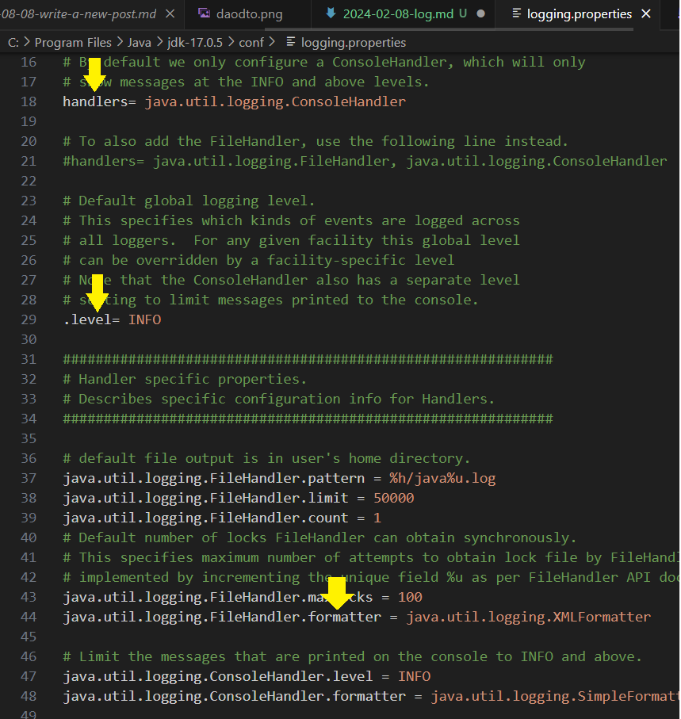
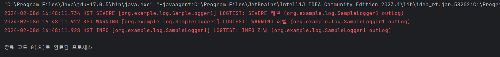

# 로그 출력

로그: 컴퓨터 이용 상황이나 프로그램 실행 상황, 데이터 송수신 상황 등을 기록한 파일

- OS나 애플리케이션이 생성하는 파일로, 날짜와 처리 내용 등이 기록된다.
- 확장자 `.log`
- 로그를 분석함으로써 언제, 누가, 무엇, 어떻게 했는지 등을 파악

> - 로깅: 로그를 로그 파일에 기록하는 처리
> - 로거: 시스템 가동 중 로그를 기록하는 프로그램

## 로그의 종류

- 서버와 네트워크 기기의 시스템 로그
- 인증 로그
- 데이터베이스 감사 로그
- 사이트 액세스 로그

## 자바의 로깅 API

- 자바에서는 표준 로그 기능이 java.util.logging 패키지로 제공
- java.util.logging 은 자바 1.4부터 등장
- (그 이전 자바에서는 로깅 API가 기본으로 제공되지 않았음)

### 왜 로거 클래스를 만들까?

- `System.out.println()` 메서드를 큰 규모에서는 일일이 추가하고 컴파일 하여 다시 동작을 확인하는 과정은 비효율적이기 때문이다.
- 보통 println 메서드를 사용할 때는 로그를 위해 추가했음을 나중에 알 수 있게 소스코드에 `TODO` 등의 표시를 남겨야 한다.
- 삭제할 때는 필요한 코드까지 삭제해버릴 위험도 있기 때문이다.

### 로그 레벨

- 로그레벨: 로그를 어디까지 출력할지 결정하는 기준값이다.
- 로거는 지정한 레벨에 따라 출력할 내용을 자동으로 추출해준다.
- 로그 레벨에 따라 용도에 맞게 필요한 로그만 확인할 수 있다.

| 로그 레벨 | 출력할 로그의 내용           |
| :-------- | :--------------------------- |
| SEVERE    | 매우 중요                    |
| WARNING   | 경고                         |
| INFO      | 정보                         |
| CONFIG    | 구성의 설정에 관한 정보      |
| FINE      | 디버그 등에 필요한 상세 정보 |
| FINER     | 좀 더 상세한 정보            |
| FINESET   | 아주 상세한 정보             |
| ALL       | 모든 로그를 출력             |
| NONE      | 출력하지 않음                |

- 시스템 운영 시에는 일반적으로 `INFO`: 기본 로그 레벨
- 로그 레벨은 프로그램 혹은 프로퍼티 파일의 `.level` 항목에서 변경할 수 있다.

---

### 로그 출력 방식

- java.util.logging 패키지에서는 로그 출력을 담당하는 핸들러를 바꿔서 로그 출력 방식을 변경할 수 있다.
- 아래의 표는 기본으로 제공되는 핸들러이다.

| 이름           | 설명                                                         |
| :------------- | :----------------------------------------------------------- |
| StreamHandler  | 핸들러의 기저 클래스로, 스트림상에 로그를 출력한다.          |
| ConsoleHandler | 콘솔에 로그를 출력한다.                                      |
| FileHandler    | 지정한 파일에 로그를 출력한다.                               |
| SocketHandler  | 동작 환경의 로그를 실시간으로 확인하고 싶은 경우에 사용한다. |
| MemoryHandler  | 메모리에 로그를 캐싱한다.                                    |

- 핸들러는 프로퍼티 파일의 `.handles` 항목에서 변경할 수 있다.
- 위에 복수형으로 된 것처럼, 👉`출력방식을 복수`로 설정할 수도 있다.
- 로그 레벨도 핸들러 단위로 설정할 수 있다.

### 로그 출력 형식

- 로그를 출력할 때 형식은 포매터(Formatter)로 변경할 수 있다.
- java.util.logging 패키지 포매터에는 다음과 같은 종류가 있다.
  > - 간단한 종류를 출력하기 위한 `SimpleFormatter`
  > - XML 형식으로 로그를 출력하는 XMLFormatter
- 자바 7부터는 SimpleFormatter에서 사용할 포매터를 변경할 수 있게 됐다.
  --> 기본 포맷은 읽기가 어려우므로 우선은 직접 포맷 설정
- 프로퍼티 파일: `.formatter` 라는 항목에서 설정할 수 있다.

| 이름            | 설명                                                                             |
| :-------------- | :------------------------------------------------------------------------------- |
| SimpleFormatter | 자바 6 이전에는 1~2행으로 로그를 출력. 자바 7부터는 포매터를 사용자화할 수 있다. |
| XMLFormatter    | XML형식으로 로그를 출력한다.                                                     |

```java
// SimpleFormatter 사용 예
java.util.logging.SimpleFormatter.format = %1tFT%1$tT, %1$tL+%1$tZ %2$s %3$s \%4$s %5$s %6$s%n
```

<br>

- %1$tF: 1$로 파라미터 date를 날짜 형식(YYYY-mm-DD)로 설정
- %1$tT: 1$로 파라미터 date를 시각 형식(HH:MM:SS)으로 설정
- %1$tL: 1$로 파라미터 date를 3자리 밀리초 형식으로 설정
- %1$tZ: 1$로 파라미터 date를 시간대 명칭을 출력
- %2$s: 2$로 파라미터 source를 문자열(s)로 설정한다.
- %3$s: 3$로 파라미터 logger를 문자열(s)로 설정
- %4$s: 4$로 파라미터 level을 문자열(s)로 설정
- %5$s: 5$로 파라미터 message를 문자열(s)로 설정
- %6$s: 6$로 파라미터 thrown을 문자열(s)로 설정

<br>

## 로그 출력을 제어하는 프로퍼티 파일

- 로그 출력에 관한 설정을 기술: logging.properties 프로퍼티 파일
- JDK를 설치한 폴더 아래의 👉`jre\lib`에 저장
- test
<!-- >  -->

- 자주 설정하는 것: hanlders, .level, formatter

### 로그 출력을 변경하는 방법

> - 표준 프로퍼티 파일을 직접 편집한다.
> - 프로그램으로 설정한다.
> - 직접 프로퍼티 파일을 작성한다.

## FileHandler 핸들러 지정

- ConsoleHandler와 함께 자주 이용하는 핸들러: FileHandler

### FileHandler의 프로퍼티

| 설정항목  | 설명                                                                                                                                                                                                                                                                                                                              |
| :-------- | :-------------------------------------------------------------------------------------------------------------------------------------------------------------------------------------------------------------------------------------------------------------------------------------------------------------------------------- |
| pattern   | 출력 파일명을 정하는 방법을 지정하는 데 사용<br>- `/`: 파일 경로 구분<br>- `%t`: 시스템 임시 폴더 <br> - `%h`:user.home 시스템 프로퍼티 값<br>- `%g`: 로그 로테이션을 식별하는 생성 번호(0, 1, 2...처럼 연속된 번호). java%g.log로 지정한 경우, java0.log, java1.log... 처럼 카운트 <br> - `%u`: 중복을 해결하기 위한 유일한 번호 |
| limit     | 출력 파일의 최대 크기(단위는 바이트)                                                                                                                                                                                                                                                                                              |
| count     | 출력 파일을 `순환`할 최대 수                                                                                                                                                                                                                                                                                                      |
| formatter | 출력을 위한 포매터                                                                                                                                                                                                                                                                                                                |
| filter    | 로그를 출력할 곳을 설정하는 데 사용(기본은 지정하지 않음)                                                                                                                                                                                                                                                                         |
| encoding  | 사용할 문자셋 인코딩 이름                                                                                                                                                                                                                                                                                                         |
| append    | 파일을 추가 모드로 할 경우에는 true로 설정(기본은 false)                                                                                                                                                                                                                                                                          |
| level     | 로그 레벨                                                                                                                                                                                                                                                                                                                         |

> - 예를 들어 test%u.%g.log로 지정한 경우, test1.0.log, test2.0.log, test3.0.log처럼 파일명이 설정됩니다.

- `순환`: 지정한 로그 수를 초과하면 오래된 것부터 삭제하는 것. 지정한 수지보다 로그 수가 늘어나지 않게 제어하는 항목이다.

#### 기본 로그 출력 레벨

- `.level`: 기본적으로 INFO로 되어있다.
- 출력하고 싶은 레벨로 설정하려면 [로그 레벨의 종류](#로그-레벨)을 참조!

### 1) 콘솔에 로그 추력

- java.util.logging 패키지를 이용하는 구체적인 예
- System.out.println 메서드를 단순히 로거로 치환하는 예

```java
package org.example.log;

import java.util.logging.ConsoleHandler;
import java.util.logging.Level;
import java.util.logging.Logger;

// 콘솔에 로그 출력
public class OutputConsoleLog {
    public static void main(String[] args) {
        // INFO 레벨 설정
        // 지정한 로그 레벨을 설정한다.
        Logger.getGlobal().setLevel(Level.INFO); // 로거에 설정할 이름을 인수로 지정

        Logger logger = Logger.getLogger(Logger.GLOBAL_LOGGER_NAME);
        // 지정한 서브 시스템의 로거를 취득 및 생성한다.

        // 로그 출력 방식 설정
        logger.addHandler(new ConsoleHandler(){
            {
                setOutputStream(System.out);
                setLevel(Level.INFO);
            }
        });

        Logger.getGlobal().severe("로그 레벨: severe");
        Logger.getGlobal().warning("로그 레벨: warning");
        Logger.getGlobal().info("로그 레벨: info");
        Logger.getGlobal().config("로그 레벨: config");
        Logger.getGlobal().fine("로그 레벨: fine");
        Logger.getGlobal().finer("로그 레벨: finer");
        Logger.getGlobal().finest("로그 레벨: finest");
    }
}

---------------------------------------------------
// 콘솔 출력 결과
"C:\Program Files\Java\jdk-17.0.5\bin\java.exe" "-javaagent:C:\Program Files\JetBrains\IntelliJ IDEA Community Edition 2023.1\lib\idea_rt.jar=58102:C:\Program Files\JetBrains\IntelliJ IDEA Community Edition 2023.1\bin" -Dfile.encoding=UTF-8 -classpath C:\Users\SEOJIN\SJ_STUDY\DBTest\target\classes;C:\Users\SEOJIN\.m2\repository\org\postgresql\postgresql\42.5.1\postgresql-42.5.1.jar;C:\Users\SEOJIN\.m2\repository\org\checkerframework\checker-qual\3.5.0\checker-qual-3.5.0.jar org.example.log.OutputConsoleLog
2월 08, 2024 4:31:23 오후 org.example.log.OutputConsoleLog main
SEVERE: 로그 레벨: severe
2월 08, 2024 4:31:23 오후 org.example.log.OutputConsoleLog main
WARNING: 로그 레벨: warning
2월 08, 2024 4:31:23 오후 org.example.log.OutputConsoleLog main
INFO: 로그 레벨: info


```

---

### 2) 프로그램 내부에서 프로퍼티를 설정해 로그 출력

- 로그 출력 방법을 변경할 때, 프로그램 내부에서 프로퍼티 정보를 직접 편집할 수도 있다.
- java.util.logging 패키지의 클래스는 LogManager 클래스의 설정에 따라 동작하게 되어있다.
- 프로퍼티 내용은 상수 PROPERTIES_STRING에 설정했다.
  > - 핸들러에는 java.util.logging.ConsoleHandler(콘솔로 출력)를 설정
  > - 로그 레벨은 info
  > - 출력되는 로그의 레이아웃을 변경하기 위한 SimpleFormatter 설정
  > - SimpleFormatter 의 출력형식을 커스터마이징

```java
package org.example.log;

import java.io.ByteArrayInputStream;
import java.util.logging.LogManager;
import java.util.logging.Logger;

// 프로그램 내부에서 프로퍼티를 설정해 로그 출력
public class SampleLogger1 {
    // 프로퍼티 설정 내용
    protected static final String PROPERTIES_STRING = "handlers=java.util.logging.ConsoleHandler\n"
            + ".level=INFO\n"
            + "java.util.logging.ConsoleHandler.level=INFO\n"
            + "java.util.logging.SimpleFormatter.format=%1$tY-%1$tm-%1$tdd %1$tH:%1$tM:%1$tS.%1$tL %1$tZ %4$s [%3$s] %5$s (%2$s) %6$s%n\n";

    private static Logger logger = null;

    // 스태틱 이니셜라이저로 LogManager에 값을 설정한다.
    // static 이니셜라이저: 클래스 로드 시 한 번만 실행되는 처리
    static{
        try{
            //LogManager에 프로퍼티 설정 내용을 가져온다.
            // readConfiguration 메서드의 역할이다. (프로퍼티 설정을 읽어들이는 것)
            // 상수 PROPERTIES_STRING의 내용을 ByteArrayInputStream 객체를 거쳐 읽어들이고 있다.
            LogManager.getLogManager().readConfiguration(new ByteArrayInputStream(PROPERTIES_STRING.getBytes("UTF-8")));
            logger = Logger.getLogger(SampleLogger1.class.getName());
        }catch (Exception e){
            e.printStackTrace();
        }
    }

    public static void main(String[] args) {
        SampleLogger1 saLogger = new SampleLogger1();
        saLogger.outLog();
    }

    public void outLog(){
        logger.severe("LOGTEST: SEVERE 레벨");
        logger.warning("LOGTEST: WARNING 레벨");
        logger.info("LOGTEST: INFO 레벨");
        logger.config("LOGTEST: CONFIG 레벨");
        logger.fine("LOGTEST: FINE 레벨");
        logger.finer("LOGTEST: FINER 레벨");
        logger.finest("LOGTEST: FINEST 레벨");
    }

}

--------
// 출력 결과
"C:\Program Files\Java\jdk-17.0.5\bin\java.exe" "-javaagent:C:\Program Files\JetBrains\IntelliJ IDEA Community Edition 2023.1\lib\idea_rt.jar=58202:C:\Program Files\JetBrains\IntelliJ IDEA Community Edition 2023.1\bin" -Dfile.encoding=UTF-8 -classpath C:\Users\SEOJIN\SJ_STUDY\DBTest\target\classes;C:\Users\SEOJIN\.m2\repository\org\postgresql\postgresql\42.5.1\postgresql-42.5.1.jar;C:\Users\SEOJIN\.m2\repository\org\checkerframework\checker-qual\3.5.0\checker-qual-3.5.0.jar org.example.log.SampleLogger1
2024-02-08d 16:48:11.734 KST SEVERE [org.example.log.SampleLogger1] LOGTEST: SEVERE 레벨 (org.example.log.SampleLogger1 outLog)
2024-02-08d 16:48:11.927 KST WARNING [org.example.log.SampleLogger1] LOGTEST: WARNING 레벨 (org.example.log.SampleLogger1 outLog)
2024-02-08d 16:48:11.928 KST INFO [org.example.log.SampleLogger1] LOGTEST: INFO 레벨 (org.example.log.SampleLogger1 outLog)

```

<!--  -->

### 3) 프로퍼티 파일을 사용해서 로그 출력

- 일반적으로 설정 정보는 외부에 두는 것이 나중에 수정하기도 편리하다.
- 설정 정보를 외부에 두면 설정이 바뀌어도 프로그램 본체를 수정할 필요가 없기 때문이다.
- 로그 출력 내용을 설정한 프로퍼티 파일을 직접 작성해서 로글르 출력하는 방법

- 프로퍼티 파일명은 Logger.properties로 한다.
- 확장자가 `.properties` 붙이기만 하면, 파일명은 자유롭게 지정해도 상관없다.

```properties
# 로그 출력 방식 지정
# 콘솔에 로그를 출력 + 파일에 로그를 출력 (양쪽 모두 설정하는 것이 일반적)
handlers= java.util.logging.ConsoleHandler, java.util.logging.FileHandler.level=FINE

# 핸들러 공통의 출력 레벨
# 개별 핸들러에서 사용할 로그 레벨을 지정할 수 있지만, INFO로 설정했으므로
# 개별 핸들러 설정 시 FINE으로 지정해도 INFO까지의 로그만 출력된다.
java.util.logging.ConsoleHandler.level=INFO
java.util.logging.ConsoleHandler.formatter=java.util.logging.SimpleFormatter

# FileHandler 출력 레벨은 FINE으로 설정
java.util.loggingFileHandler.level=FINEST
java.util.loggin.FileHandler.pattern=TestPropertiesLog%u.%g.log
# SimpleFormatter의 로그 출력은 기본적으로 2줄로 출력된다.
java.util.logging.FileHandler.formatter=java.util.logging.SimpleFormatter
# 서식을 직접 명시 1줄로 표시하도록
java.util.logging.FileHandler.pattern=C:/temp/SampleLogger%u.%g.log
java.util.logging.FileHandler.append=true
java.util.logging.FileHandler.count=5

java.util.logging.SimpleFormatter.format=%1$tF %1$tT.%1$tL %4$s %2$s %5$s %6$s%n
```

### 프로퍼티 파일의 배치 장소

- 현재 폴더에서 읽어들이는 방법
- 클래스 로더를 이용하는 방법

1. 현재 폴더에서 읽어들이는 방법

```java
private static final String PROPERTIES = "SampleLogger.properties";
InputStream inStream = new FileInputStream(PROPERTIES);
LogManager.getLogManager().readConfiguration(inStream);
```

2. 클래스 로더 사용

```java
private static final String PROPERTIES = "SampleLogger.properties";
final InputStream inStream = SampleLogger2.class.getClassLoader().getResourceAsStream(PROPERTIES);
LogManager.getLogManager().readConfiguration(inStream);
```

- 실행할 파일을 저장한 src/main/resources 폴더 아래 프로퍼티 파일을 배치한다.
- 그리고 다음과 같이 LogManager를 설정한다.
- 여기서는 프로퍼티 파일을 상수로 지정했다. (직접 파일명을 지정해도 상관없음)

```properties
# Logger.properties 파일명

handlers=java.util.logging.ConsoleHandler, java.util.logging.FileHandler
.level=FINE

java.util.logging.ConsoleHandler.level=INFO
java.util.logging.ConsoleHandler.formatter=java.util.logging.SimpleFormatter

java.util.loggingFileHandler.level=FINEST
java.util.loggin.FileHandler.pattern=TestPropertiesLog%u.%g.log
java.util.logging.FileHandler.formatter=java.util.logging.SimpleFormatter
java.util.logging.FileHandler.append=true
java.util.logging.FileHandler.count=5

java.util.logging.SimpleFormatter.format=%1$tF %1$tT.%1$tL %4$s %2$s %5$s %6$s%n
```

---

```java
// SampleLogger2.java
package org.example.log;

import java.io.IOException;
import java.io.InputStream;
import java.util.logging.LogManager;
import java.util.logging.Logger;

public class SampleLogger2 {
    // 로그 설정 프로퍼티 파일명
    private static final String PROPERTIES = "Logger.properties";
    private static Logger logger = null;

    static{
        try{
            logger = Logger.getLogger(SampleLogger2.class.getName());
            // 클래스 패스 안에서 프로퍼티 파일 취득
            logger.fine("로그 설정 프로퍼티 파일: "+ PROPERTIES + "를 바탕으로 로그 설정");
            final InputStream inpStm = SampleLogger2.class.getClassLoader().getResourceAsStream(PROPERTIES);

            // 프로퍼티 파일을 찾지 못하면 오류를 던진다.
            if(inpStm == null){
               logger.info("로그 설정: " + PROPERTIES + "는 클래스 패스 상에서 찾을 수 없습니다.");
            }else{
                try{
                    // 프로퍼티 파일의 내용을 로그 매니저에 설정
                    LogManager.getLogManager().readConfiguration(inpStm);
                    logger.info("로그 설정 완료: LogManager를 설정했습니다.");
                }catch (IOException e){
                    logger.warning("로그 설정 실패: LogManager 설정 시 "+ "예외가 발생했습니다: " + e.toString());
                }finally {
                    try{
                        if(inpStm != null)
                            inpStm.close();
                    }catch (IOException e){
                        logger.warning("로그 설정 실패: 로그 설정 프로퍼티 " + " 파일 닫기 시 예외가 " + "발생했습니다: " + e.toString());
                    }
                }
            }
        }catch (Exception e){
            e.printStackTrace();
        }
    }

    public static void main(String[] args) {
        SampleLogger2 sampleLogger2 = new SampleLogger2();
        sampleLogger2.outLog();
    }

    public void outLog(){
        logger.severe("LOGTEST: SEVERE 레벨");
        logger.warning("LOGTEST: WARNING 레벨");
        logger.info("LOGTEST: INFO 레벨");
        logger.config("LOGTEST: CONFIG 레벨");
        logger.fine("LOGTEST: FINE 레벨");
        logger.finer("LOGTEST: FINER 레벨");
        logger.finest("LOGTEST: FINEST 레벨");
    }
}

```
